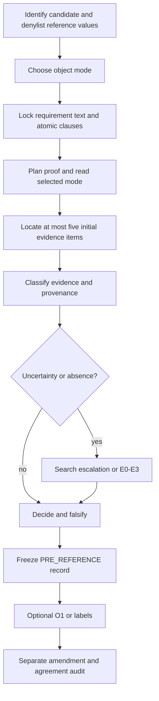

# Pre-upgrade audit (v8, b918d79)

Read before changing the skill: all 22 tracked files, all 14 references, all tests,
and the repository layout. Baseline: `python -m pytest -q` -> 22 passed.
This is a historical inventory; final authority is documented in architecture.md.

## Actual requirement flow

## File inventory

`Pkg` means metadata/link/discovery tests only, not behavioral coverage. Mode and
reference paths below are relative to `skills/universal-agent-judge/`.

| File | Role / load condition | Caller | Authority | Duplication | Conflict risk | Tested? |
|---|---|---|---|---|---|---|
| SKILL.md | Entry; every judgment | Agent discovery | Contract, semantic verdict, lock | Artifact/provenance rules repeated in guides | Missing typed roles and schema | Pkg |
| references/mode-workspace.md | Repository snapshot | Entry | Workspace evidence | Reachability / dataset / artifact | Low; backlinks not execution loops | Pkg + manual W cases |
| references/mode-function.md | Function/class | Entry | API and boundaries | Oracle boundary | Examples cannot cover full contract | Pkg + manual F cases |
| references/mode-patch.md | Diff/issue | Entry | Active changed path | Reachability / oracle | Regression scope could expand rubric | Pkg + manual P cases |
| references/mode-trajectory.md | Tool trace | Entry | Trace evidence axes | Visibility vs absence | Ledger classes not normalized to schema | Pkg + manual T cases |
| references/mode-notebook-ml.md | Experiment | Entry | Five ML obligations | Dataset / artifact | Code, execution and saved output conflation | Pkg + manual N cases |
| references/mode-artifact.md | Final deliverable | Entry, workspace, notebook | Actual file inspection | Producer vs submitted and runtime | Missing object vs missing required file needs clarity | Pkg + manual A cases |
| references/dataset-provenance.md | Named data | Entry, workspace, notebook | Dataset identity | Filename warning repeated | Weak identity incorrectly treated as proof of failure by N-A | Pkg + manual N-A |
| references/runtime-verification.md | Execution / O1 | Entry, function | E0-E3/O1, amendments | Lock and environment rules | No isolation/timeouts; E0 import executes code | Pkg |
| references/provenance.md | Runtime / file origin | Entry, runtime | Four origin classes | Artifact/runtime prose | No structured file delta | Pkg |
| references/flags-full.md | Diagnostic condition | Entry | Flag names and triggers | Some flags overlap | No exclusions or formal effects | Pkg |
| references/benchmark-adapters.md | Named benchmark packaging | Entry | Object mapping only | Blind boundary | Mapping may be mistaken for new requirements | Pkg |
| references/output-example.md | Report formatting | Entry | Example only | Main output columns | No lossless JSON representation | Pkg |
| references/post-reference-metrics.md | Aggregate after lock | Entry | Agreement definitions | Lock boundary | No null/rounding policy | Pkg |
| references/disagreement-audit.md | Mismatch after lock | Entry | Error categories | Immutable record | Amendment has no machine shape | Pkg |
| tests/test_package.py | Test suite | pytest | Package checks | None | Cannot detect semantic regression | Executed |
| tests/regression-cases.md | Manual scenarios | tests README | Expected scenarios only | Mirrors prose | N-A too strict; W-S runtime claim under-evidenced | Link only |
| tests/README.md | Test instructions | Human | Validation limits | Main README | No executable fixtures | Link only |
| docs/design-notes.md | Historical design | README | v8 history only | README | Old pass counts must stay historical | Link only |
| README.md | Installation / overview | Human | Packaging | Skill summary | No scoring or schema usage | Link only |
| requirements-dev.txt | Dev dependencies | pip | Test dependencies | None | No JSON/notebook validation deps | No dedicated test |
| .gitignore | Exclude local generated files | Git | Packaging exclusions | None | Future runtime logs need exclusion | No dedicated test |

## Findings to resolve

- No dead reference: all 14 are linked from the entry. Backlinks to shared policy
  form a document graph cycle, but do not instruct recursive loading. Mark policy
  pointers separately from conditional loading in the new architecture.
- Verdict ambiguity: absent whole candidate is ungradable, while an accessible
  workspace with a proven missing required artifact fails that clause. Encode both.
- Dataset identity: lack of source evidence is not positive proof of wrong data.
  Require contradiction for wrong-source failure, or an explicit documentation
  obligation plus absence proof; otherwise report ungradable identity.
- Undefined structures: clause matrix, immutable record, penalties, runtime delta,
  dependency view, and post-reference amendment need a common typed record.
- Flags are stated to be diagnostic, but have no non-trigger conditions or score
  boundary. Preserve separation with behavioral and arithmetic tests.
- Notebook cell counts cannot establish freshness, and source presence cannot prove
  historical execution. Add eight separate obligations and clean-run provenance.
- Reference solutions are not a distinct role. Classify before semantics, prevent
  reading ambiguous possible references, and enforce ordered access in tooling.
- No candidate repair loop will be adopted from upstream evaluator/optimizer skills.
  Use only structured criteria, reproducibility, explicit thresholds, and logged
  evaluation history. No threshold relaxation to improve reported pass rate.
